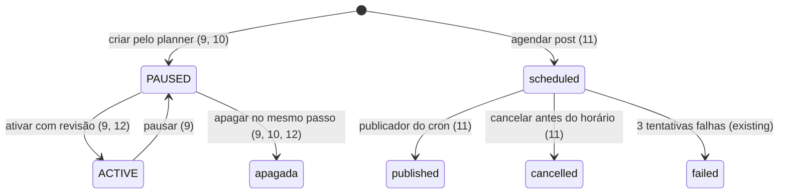

# Fechar o movimento hub-marketing-agentes (Fase A)

> Build this with **tlc-implement**. Execução coordenada pelo Claude central (ver `.tasks/acompanhamento.md`).
> Every criterion below becomes a check with a proof, referenced by its number. Nothing under
> `Unresolved` gets settled while building.

## Intent

O hub está em produção desde 01/10/2026 (PR #49, `5f0d1aee`), mas metade dele não funciona ou não foi
provada. Os logs da `marketing-hub` de 01/10, entre 00:27 e 02:27 UTC, mostram
`Google: Google OAuth 401: unauthorized_client` nos blocos `ga4`, `gsc`, `google_ads` e `campanhas_google`.
Às 02:14 UTC, o bloco `facebook` (período de 30 dias) falhou com
`(#10) This endpoint requires the 'pages_read_user_content' permission or the 'Page Public Content Access' feature`.

Em 01/10, às 20:37 UTC, a produção estava assim:
- 0 contas `MARKETING_AGENT`;
- 0 linhas em `marketing_actions` e em `scheduled_posts`;
- `oauth-callback` (público, grava com service role), `refresh-tokens`, `sync-meta-ads` e `sync-meta-organic`
  seguem `ACTIVE`.

Quem paga:
- o Lucca vê só a Meta;
- o dot não tem como entrar;
- nenhuma escrita foi provada em conta real;
- um endpoint público sem uso continua no ar.

**Causa do erro do Google:** `unauthorized_client` no endpoint de token quer dizer que o refresh token foi
emitido para um client OAuth diferente do que tenta renová-lo. Secret errado daria `invalid_client`, e token
expirado ou revogado daria `invalid_grant`. Por isso "secrets corretamente setadas" não exclui a causa: um
token gerado no OAuth Playground sem "Use your own OAuth credentials" pertence ao client do Playground e
nunca vai renovar com o client `no-hub`.

**O que muda quando isto entrar:**
- o planner mostra GA4, Search Console e Google Ads;
- o Facebook lê períodos de 30 dias;
- o dot entra com conta própria e responde à pergunta-exemplo do intent;
- cada escrita foi provada em conta real com o prefixo "[teste hub]" e apagada no mesmo passo;
- o legado de abril saiu de produção;
- o `execution.md` fecha o movimento;
- o Lucca recebe a lista de segredos a rotacionar.

22 critérios em 8 slices · 2 one-way doors · 4 abertos, dos quais 1 bloqueia e 1 bloqueia o go-live.

## Criteria

### Google lido no planner

1. Dado que o Lucca conectou o Google pelo planner (critério 17), quando ele abre `https://app.notechstack.com.br/no/marketing/visao-geral?periodo=7d` e clica em "Buscar números frescos (sem cache)", então:
   - os blocos `ga4`, `search_console` e `google_ads` voltam com `ok: true`;
   - os logs da `marketing-hub` posteriores a esse clique não têm nenhuma linha com `unauthorized_client`.
2. Quando a tela Campanhas é aberta com `?periodo=30d`, então o bloco `google` volta com `ok: true`: a tabela, ou "Nenhuma campanha Google ainda." se a conta não tiver campanhas.
3. Sempre, os prefixos `ya29.`, `1//0`, `GOCSPX-` e `EAA` aparecem 0 vezes em quatro lugares: no diff da branch, nos arquivos sob `docs/` e `.tasks/`, nas mensagens de commit e nos logs da `marketing-hub` do período da execução.

### Facebook orgânico completo

4. Quando a Visão geral é pedida com `?periodo=30d&fresco=1`, então o bloco `facebook` volta com `ok: true`, e o log da função não tem nenhuma linha com `pages_read_user_content` depois do deploy da correção.
5. O `execution.md` registra o campo da consulta `/{page}/posts` que exigia `pages_read_user_content`. A evidência é a resposta da Graph com o campo e sem ele, e o registro diz se a correção removeu o campo ou se pediu a permissão (Unresolved 4).

### Conta do dot

6. Quando o Lucca convida `notechstack+dot@gmail.com` na aba Dot e o dot define a senha pelo link em `/no/marketing/acesso`, então `auth.users` tem exatamente 1 conta com `app_metadata.role = MARKETING_AGENT`, e essa conta entra em `/no/marketing/visao-geral` sem desafio TOTP.
7. Quando o dot, logado na conta própria, recebe a pergunta-exemplo do intent ("quanto a nó gastou e quantos leads vieram da Meta e do Google nos últimos 7 dias, e quais páginas mais cresceram no Search Console"), então a resposta dele traz os mesmos números que o planner mostra para `?periodo=7d` no mesmo momento.
8. Com o token da sessão do dot:
   - `GET /marketing-hub/agent` → 403 `FORBIDDEN`;
   - `rpc list_admin_saldos` → 403;
   - `/no/projetos` no app → `/nao-autorizado`.

   Depois de "Desligar dot", qualquer chamada dele → 401 `UNAUTHENTICATED`. Depois de "Religar", `GET /marketing-hub/overview?periodo=7d` → 200.

### Escritas provadas em conta real (cada uma com OK do Lucca no chat, na hora)

9. Quando o Lucca cria pelo planner a campanha Meta "[teste hub] AC2" (1 conjunto, 1 anúncio com imagem), então:
   - o Ads Manager mostra a campanha `PAUSED`, com orçamento, público e criativo iguais aos da tela de revisão;
   - ativar pelo planner a muda para `ACTIVE` e pausar a devolve para `PAUSED`;
   - ela é apagada no mesmo passo, e no fim o Ads Manager tem 0 campanhas com "[teste hub]".
10. Dado que a V6 passou e o Lucca criou `GOOGLE_ADS_CREATE_ENABLED=true`, quando ele cria pelo planner a campanha de Pesquisa "[teste hub] AC3", então:
    - o Google Ads mostra a campanha `PAUSED`, com orçamento diário, palavras-chave e anúncio responsivo iguais aos da revisão;
    - ela é removida no mesmo passo.

    Se o Explorer Access recusar a criação, então a execução para, sem pedir Basic Access.
11. Quando o Lucca agenda um post IG de imagem, um reel e um post FB (Unresolved 2), então:
    - cada um sai em até 5 minutos do horário marcado, com `scheduled_posts.status = published` e `external_post_id` preenchido;
    - um quarto post, cancelado antes do horário, termina em `status = cancelled` e não aparece na rede.
12. Quando o dot cria pelo planner uma campanha Meta, uma campanha Google e um post agendado, e ativa a campanha Meta depois de o Lucca autorizar no chat do dot, então cada escrita tem 1 linha em `marketing_actions` com `actor_role = MARKETING_AGENT`, `payload`, `result` e `status = ok`. Os objetos de teste são apagados no mesmo passo.

### Números conciliados

13. Quando o planner e os painéis nativos são lidos no mesmo período fechado e no mesmo fuso (`America/Sao_Paulo`):
    - o gasto Meta de cada dia fechado bate ao centavo com o Ads Manager da conta `act_1415926037237997`;
    - GA4, Search Console e Google Ads batem com os próprios painéis.

    O `execution.md` traz a tabela lado a lado, e cada diferença tem o motivo escrito.

### Legado fora de produção

14. Depois do OK do Lucca:
    - `list_edge_functions` não lista `oauth-callback`, `refresh-tokens`, `sync-meta-ads` nem `sync-meta-organic`;
    - `meta-capi`, `track-evento` e `painel-dados` seguem `ACTIVE`, com a mesma `version` de antes da remoção.

### Registro e rotação

15. O `docs/movimentos/2026-09-30-hub-marketing-agentes/execution.md` termina em `status: implemented` se os critérios 1–14 passarem. Se não, termina em `needs_verification`, listando por número o que falta. A skill `sync-vault` foi rodada e a memória `hub-marketing-agentes-estado.md` foi atualizada.
16. O arquivo `docs/movimentos/2026-09-30-hub-marketing-agentes/rotacao-segredos.md` lista, para cada segredo usado pelo hub, seis campos:
    - o nome;
    - onde ele está (Supabase secret ou Vault);
    - qual painel o emite, com o link direto;
    - quem depende dele;
    - a ordem de rotação;
    - como provar que a rotação funcionou.

    O arquivo tem 0 valores de segredo (critério 3).

### Conexão do Google pelo planner (decisão do Lucca em 01/10: "Botão no planner")

17. Quando o Lucca (`NO_ADMIN`, `aal2`) clica em "Conectar Google" na tela `/no/marketing/conexoes`:
    - o navegador vai para a tela de consentimento do Google pedindo exatamente `https://www.googleapis.com/auth/adwords`, `https://www.googleapis.com/auth/analytics.readonly` e `https://www.googleapis.com/auth/webmasters.readonly`, com `access_type=offline` e `prompt=consent`;
    - depois de autorizar, o navegador volta para `/no/marketing/conexoes?google=ok`, e a linha "Google OAuth" mostra `ok`.
18. Se o `state` do retorno não existir, tiver passado de 10 minutos ou já tiver sido usado, então:
    - a função não troca o código e não grava nada no Vault;
    - o navegador volta para `/no/marketing/conexoes?google=erro&motivo=state_invalido`.
19. Se o Google devolver `error=access_denied` ou se a troca do código falhar, então o navegador volta para `/no/marketing/conexoes?google=erro&motivo=access_denied` ou `motivo=troca_falhou`, e o refresh token anterior continua em uso.
20. Quando o dot (`MARKETING_AGENT`) chama `POST /marketing-hub/google/connect`, recebe 403 `FORBIDDEN`. O botão "Conectar Google" não aparece para ele.
21. Sempre, o refresh token existe só no Vault (`marketing_google_refresh_token`), e o prefixo `1//0` aparece 0 vezes em respostas HTTP, URLs, logs, `marketing_cache` e `marketing_actions`. A função lê primeiro o Vault e cai no secret `GOOGLE_OAUTH_REFRESH_TOKEN` só se o Vault estiver vazio.
22. Cada conexão gera 1 linha em `marketing_actions` com `kind = google.conectar` e `actor_role = NO_ADMIN`, sem token no `payload` nem no `result`.

## States

## Out of scope

- O Executor digitar, colar ou gerar tokens, chaves ou senhas; criar contas; conceder OAuth. Isso é sempre do Lucca, mesmo com autorização e mesmo que o chat seja apagado depois.
- Pedir Basic Access do Google Ads ou trocar de app Meta: são condições de parada do plano aprovado.
- As melhorias do documento de 01/10, que estão em `.tasks/hub-marketing-melhorias-entrega-1.md`.
- Mexer em `meta-capi`, `track-evento`, `painel-dados`, `save-lead-progress`, checkout, `brand/` ou no "Conversions API System User".

## Observable

| Surface | Decision | Landing |
| --- | --- | --- |
| tela Visão geral | blocos Google com dados | 1 |
| tela Visão geral | bloco Google com erro | existing - `BlocoIndisponivel` com a mensagem segura |
| tela Visão geral | bloco Facebook de 30 dias | 4 |
| tela Campanhas | bloco Google vazio | 2 |
| tela Dot | link de convite | existing - aparece só na tela do NO_ADMIN e fica fora do registro (nota técnica 10) |
| tela `/no/marketing/acesso` | definir a senha do dot | existing - `MarketingAccessPage` |
| tela Conexões | botão "Conectar Google": sucesso | 17 |
| tela Conexões | botão "Conectar Google": erro e cancelamento | 18, 19 |
| tela Conexões | botão para quem não pode | 20 |
| API `POST /google/connect` | quem pode chamar | 20 |
| API `GET /google/callback` | formato do erro | 18, 19 (redirect com `google=erro&motivo=`) |
| API `marketing-hub` | quem pode chamar | 8 |
| API `marketing-hub` | formato do erro | existing - `{ error_code, mensagem }` |
| documento `rotacao-segredos.md` | estrutura e o que o leitor faz a seguir | 16 |
| documento `execution.md` | estado final | 15 |

## Swept

- validation: existing - `_shared/marketing/validacao.ts` valida campanha e post (provado no local, `marketingHub.test.ts` 27/27)
- failure modes: 4, 10
- idempotency and retry: existing - `marketing_actions.request_id` é `unique` (migration `20260930215739`); a mesma requisição não executa duas vezes (`hub_marketing_edge.mjs`); 18 (`state` de uso único)
- authorization: 8, 20
- concurrency and ordering: existing - `marketing_claim_due_posts` reserva os posts vencidos com `for update skip locked`
- data lifecycle: 9, 10, 14
- external-dependency failure: 1, 4; existing - um bloco que falha não derruba os outros (`bloco()` em `handler.ts`)
- state transitions: 9, 11
- observability: 1, 12, 22

## Impact

| Front | What changes |
|---|---|
| domain | termo novo: `conexão Google` - o refresh token emitido pelo client `no-hub` via botão do planner, guardado no Vault; vive em `_shared/marketing/google-oauth.ts` |
| stored data | segredo novo no Vault `marketing_google_refresh_token`; o secret `GOOGLE_OAUTH_REFRESH_TOKEN` vira reserva (pode ser apagado depois do critério 1) |
| Google Cloud | o Lucca adiciona o URI de redirecionamento `https://sdeowbqmwkwseyktyemn.supabase.co/functions/v1/marketing-hub/google/callback` no client OAuth `no-hub` |
| produção | 4 Edge Functions removidas (14); a fonte fica em `supabase/functions-archive/meta-2026-04/` |
| stored data | linhas de `marketing_actions` das provas ficam como registro; os objetos de teste nas plataformas são apagados |

## Decided

| Decision | Shape | Alternative rejected |
|---|---|---|
| Conexão Google pelo planner (Lucca, 01/10: "Botão no planner") | `POST /marketing-hub/google/connect` (só `NO_ADMIN` `aal2`) → `{ url }`; o app faz `window.location.assign(url)`. `state` aleatório de 32 bytes em `marketing_cache` (`google_oauth_state:<state>` → `{ user_id }`, TTL 600 s, apagado no primeiro uso). `GET /marketing-hub/google/callback?code&state` (público; o Google redireciona o navegador) troca o código com `GOOGLE_OAUTH_CLIENT_ID`/`SECRET` e `redirect_uri` igual ao cadastrado, grava em `vault` com o nome `marketing_google_refresh_token` por RPC `security definer` executável só por `service_role`, e redireciona para `${APP_URL}/no/marketing/conexoes?google=ok\|erro&motivo=`. | refazer o Playground: o token passa por mãos humanas, foi a origem do `unauthorized_client`, e com o app em "Teste" teria de ser repetido a cada 7 dias |
| Remover o legado de abril de produção (spec C4) | `supabase functions delete` de `oauth-callback`, `refresh-tokens`, `sync-meta-ads` e `sync-meta-organic`, depois do OK do Lucca | manter ACTIVE: `oauth-callback` é público e grava com service role |

## Sources

- `docs/movimentos/2026-09-30-hub-marketing-agentes/HANDOFF.md`, seção 4 (checklist da Fase A)
- `docs/movimentos/2026-09-30-hub-marketing-agentes/plan.md` (aprovado; condições de parada e as 14 notas técnicas)
- `docs/movimentos/2026-09-30-hub-marketing-agentes/spec.md` (AC1–AC11)
- Logs da `marketing-hub` de 01/10/2026 (`query_logs`, evento `marketing_bloco_falhou`): fonte dos erros citados no Intent
- Resposta do Lucca, 01/10/2026: "Botão no planner (Recomendado)". Fecha o antigo Unresolved 1 e vira os critérios 17–22 e o Decided.
- Mensagem do Lucca no chat, 01/10/2026, citada literalmente: "passo 2, está em teste e nao consigo mudar. passo 3, nao consigo pesquisar as urls diretamente. passo 4, as secrets estao corretamente setadas." e "eu quero e te dou acesso a entrar nas contas e nos links citados e setar as secrets todas como forma de testes."

This task is the record of decision. If a linked document diverges, ask before building.

## Unresolved

| # | Kind | Question | Until answered |
|---|---|---|---|
| 2 | blocks | Conteúdo dos posts reais do AC4: texto, mídia e horário de 1 post IG de imagem, 1 reel e 1 post FB. Publicação real exige OK. | O critério 11 não roda. |
| 3 | blocks go-live | O app OAuth está em "Teste" e o Lucca não consegue publicar. O agente C diagnostica no navegador, só leitura: projeto, campos que faltam, dono e usuários de teste. | Os testes rodam em "Teste": o token vale 7 dias, e a conta que autoriza precisa estar em "Usuários de teste". Em uso contínuo, o Google para a cada 7 dias até o app ser publicado. |
| 4 | open | Se o campo que exige `pages_read_user_content` for necessário, pedir a permissão? | Padrão: não pedir. A consulta usa só o que o token cobre, e o campo removido vira "—" com motivo. |
| 5 | open | Basic Access do Google Ads, se o Explorer recusar a criação de campanha | Padrão: parar (condição de parada do plano) e perguntar ao Lucca. |
