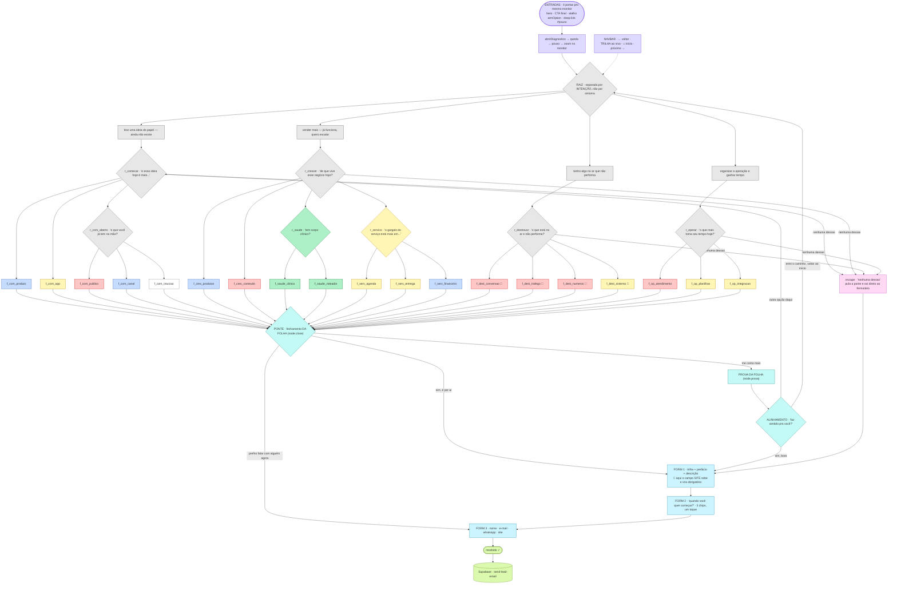

# Fluxo do CRT — árvore de diálogo do "Senta aí"

Fonte da verdade visual do `SCRIPT` de `lp-v5.html`. Espelha o board do Miro
(`nó · fluxo do CRT (LP v5)`); quando o `SCRIPT` mudar, os dois mudam na mesma leva.

Cor por nicho, igual ao `CRT_ACC` do arquivo: azul = e-commerce · verde = saúde ·
vermelho = comunicação · amarelo = apps · branco = neutro. O 🔗 marca as folhas com
`site:true`, em que o endereço faz parte do diagnóstico.

---

## 1 · A teia (reestruturada em 14/08/2026)

---

## 2 · As 10 brechas e o que foi feito

| # | Como era | O que passou a ser |
|---|---|---|
| 1 | ponte com a MESMA frase pras 14 folhas | `close` por folha, citando o que a pessoa escolheu |
| 2 | "me conta mais" com institucional único | `prova` por folha: o COMO a nó faz aquilo |
| 3 | "não é bem isso" só voltava ao RAMO | alinhamento com 3 saídas, incluindo voltar ao início |
| 4 | todo caminho terminava no formulário | saída lateral "prefiro falar com alguém agora" |
| 5 | `r1_servicos` era balde de lixo sem parede | virou sub-menu `r_servico` com 3 gargalos |
| 6 | `r2_naosei` devolvia a resposta mais curta | virou sub-menu `r_com_aberto` |
| 7 | "etapa X de 5" mentia em quase todo caminho | **barra excluída**; entrou a TRILHA ao vivo |
| 8 | opção 3 da raiz era sub-caso da opção 1 | raiz reescrita por INTENÇÃO |
| 9 | diagnosticava site sem pedir o endereço | campo `site`, que sobe pra tela 1 nas folhas 🔗 |
| 10 | nenhum sinal de tamanho | tela "quando você quer começar?" (prazo, não R$) |

## 3 · Contrato do lead (o que dá pra mudar sem tocar no backend)

A edge function `send-lead-email` desestrutura **oito campos fixos** e grava exatamente
esses. Chave fora da lista é descartada **em silêncio** — foi o que sempre aconteceu com
o `path` que a v4 mandava: nunca chegou ao banco nem ao e-mail. Por isso o front empacota
tudo dentro dos oito:

| campo | recebe |
|---|---|
| `contexto` | a intenção da raiz (+ ` · QUER FALAR AGORA`, que aparece no assunto) |
| `objetivos` | o caminho completo da árvore — é o antigo `path`, agora persistido |
| `prazo` | quando quer começar (tela 2) |
| `investimento` | vazio — faixa de R$ saiu da jornada de propósito |
| `aiAnalysis` | bloco legível: leitura da nó + site + descrição + marcas de modo |

**Pendência de backend** (fora do escopo de front): dar colunas próprias a `site`,
`descricao` e `path`, e parar de empacotar dentro de `aiAnalysis`.
